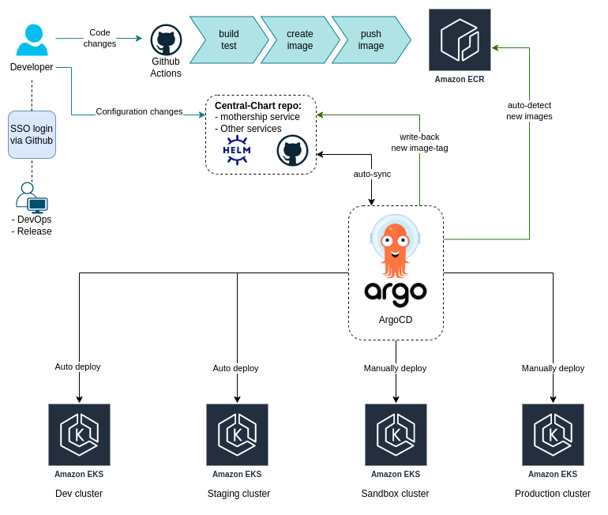

# Question

> Diagram above is from https://github.com/GoogleCloudPlatform/fourkeys. **Deployment frequency, lead time for changes, time to restore service and change failure rate** are the four key metrics to measure how good a company's DevOps culture is. We believe the companies that fall under the Elite category will be more likely to succeed.

> Let’s assume you are required to manage thousands of instances that you runned in question 1, what would you do to improve the four key metrics in this case. We understand this is a very huge topic and an open-ended question, we don’t expect a very detailed answer and a rough idea would be sufficient. This is a chance to impress us with your DevOps culture knowledge!

# Answer Question

For the 4 key metrics to measure the DevOps culture, I will describe for each of the following:

- **Deployment frequency**: I will use GitOps with [ArgoCD](https://argo-cd.readthedocs.io/en/stable/) and [ArgoCD Image Updater](https://argocd-image-updater.readthedocs.io/en/stable/) to auto-sync and deploy to the cluster. Whenever team leader tag a new version of service, CI pipeline will be run and push new docker image to Docker Registry (ECR, DockerHub...), ArgoCD Image Updater will trigger and deploy.

- **Lead time for changes**: following the *Deployment Frequency* above, The CICD pipeline will be separately with the following:
  - CI with GitHub Action (any CI tool: Jenkins, Travis, CircleCI...): build, test, and push Docker image to Docker Registry.
  - CD: ArgoCD and ArgoCD Image Updater auto sync and deploy.

- **Time to restore service**: ArgoCD supports with service tagging options, and save the history of deployment, then you can revert/restore to any tag when a service incident or a defect that impacts users occurs...

- **Change failure rate**: With this metric, We will force the development team to test them code before starting with production. We will have 3 environment with 3 cluster (staging, sandbox, production), Staging environment will be deploy automatically whenever push a tag, with sandbox and production environment, they should be deployed with approval from PM/Director.
  - In order to deploy to other non-prod environments, just tag `{env}.{year}.{week}.{deployment_number}`
  - To deploy to Production, tag `{project_name}.{year}.{week}.{deployment_number}`

| ENV       | How to trigger CI |
|-----------|-------------------|
| Staging | Merge PR to master / main branch |
| Sandbox | In master / main branch  `git tag sandbox.2023.1.1`   `git push origin sandbox.2023.1.1` |
| Production | In master / main branch   `git tag <service>.2022.22.1`   `git push origin <service>.2022.22.1` |

----------------------------------------------------------------

Here is sample of deployment I will propose:

> NOTE: https://www.aviator.co/blog/everything-wrong-with-dora-metrics/